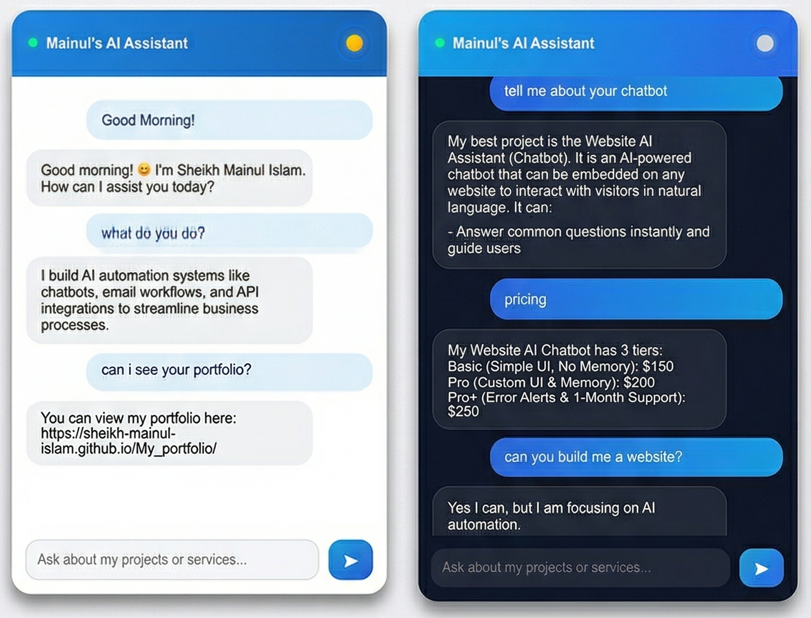
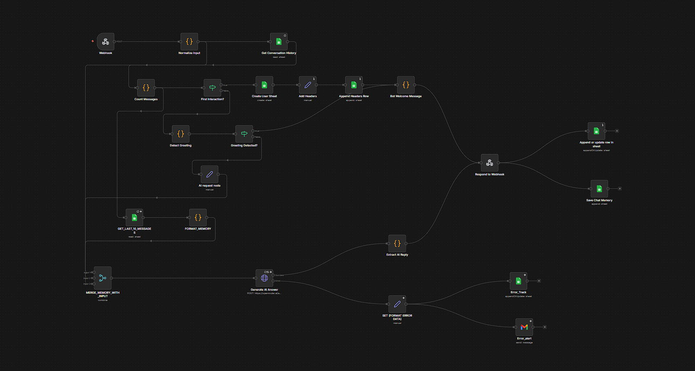

# Website AI Assistant 🤖

An intelligent, context-aware AI chatbot built to handle website FAQs, capture leads, and automatically escalate errors. 

Designed and developed by **Sheikh Mainul Islam**, this project demonstrates a complete AI automation pipeline using an n8n backend and a custom, lightweight frontend.

## 🌟 Key Features

* **Contextual Memory:** Remembers the last 10 interactions of the conversation to provide human-like, context-aware responses.
* **Lead Tracking:** Automatically logs user sessions and chat history into a structured Google Sheet.
* **Smart Greetings:** Detects incoming greetings and dynamically responds based on the time of day and context.
* **Error Escalation:** If the AI or webhook fails, the system logs the exact node error into a dedicated sheet and instantly sends an email alert via Gmail.
* **Custom UI:** A clean, dark/light mode responsive web interface with dynamic "typing" indicators.

## 🛠️ Tech Stack

* **Frontend:** HTML5, CSS3, Vanilla JavaScript
* **Backend Orchestration:** [n8n](https://n8n.io/)
* **LLM Integration:** OpenRouter API (Custom System Prompts)
* **Database / Logging:** Google Sheets API
* **Alerts:** Gmail API

## 📸 Project Previews

### The Chatbot Interface

### The Backend Automation (n8n)

## 🚀 How to Use / Setup

**1. Frontend Setup:**
* Clone this repository.
* Open `chatbot.js` and update the `webhookUrl` variable with your live n8n production webhook URL.
* Host the HTML/CSS/JS on any web server (GitHub Pages, Vercel, Netlify).

**2. Backend (n8n) Setup:**
* Import the `workflow.json` file into your n8n instance.
* Update the **Google Sheets** nodes with your specific Spreadsheet ID and connect your Google credentials.
* Update the **HTTP Request** node with your OpenRouter API Key.
* Update the **Gmail** node with your email credentials to receive error alerts.
* Activate the workflow!

## 📬 Contact & Portfolio

I build AI automation systems like chatbots, email workflows, and API integrations to streamline business processes. 

* **Portfolio:** [https://sheikh-mainul-islam.github.io/My_portfolio/](https://sheikh-mainul-islam.github.io/My_portfolio/)
* **GitHub:** [https://github.com/Sheikh-Mainul-Islam](https://github.com/Sheikh-Mainul-Islam)
